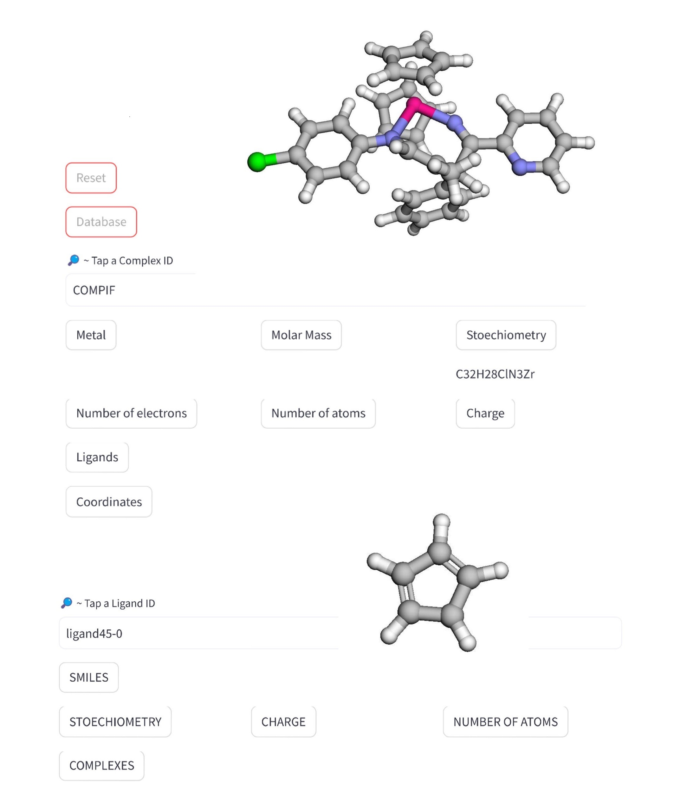

<h1 align="center">
Coordination Complex Database
</h1>

<br>


Code for a streamlit page created for users wishing to navigate databases tmqm, tmQmg and tmQmg-L more easily.

## 🔥 Usage

> Provides the metal, molar mass, stoechiometry, number of electrons, charge and ligands of over 60 000 coordination complexes ! 
> Also gives over 30 000 ligands' SMILES, stoechiometry, charge, number of atoms and complexes they can be found in !
> All complexes and ligands are shown in 3D with the help of py3Dmol.


## 👩‍💻 Installation

Create a new environment, you may also give the environment a different name. 

```
conda create -n complexify python=3.10 
```

```
conda activate complexify
```

If you need jupyter lab, install it 

```
(complexify) $ pip install jupyterlab
```

## Pre-required modules

For this project to work, the following extensions are required:

  - streamlit
  - rdkit
  - py3Dmol
  - numpy
  - pandas
  - stmol
  - matplotlib

Not to worry, pip installing the project automatically downloads all these extensions. 


## 🛠️ Development installation

Assuming git is initalized, run this line in your terminal to download the repository. 

```
git clone https://github.com/yerlikayaperi/Project-Complexify
```

🔺  **Before installing the package, please download in the Created Data file of the repository the following two files:** 🔺
- **ligands_xyzs.xyz** : https://github.com/hkneiding/tmQMg-L/blob/main/xyz/ligands_xyzs.xyz
- **tmQMg_xyz.zip** : https://github.com/hkneiding/tmQMg/blob/main/data/tmQMg_xyz.zip which should be extracted (dezipped) in a file named tmQMg_xyz in the Created Data file

While it is possible to download them directly from your terminal with commands such as ``wget`` or ``curl``, it is recommended to do it from your browser as they are extremely voluminous datasets.

To install the package, assuming you are in the path leading to the Project-Complexify folder downloaded on your device, run the following lines. It is recommended to do this in the previously created conda environment (complexify). 
```
conda activate complexify
cd Complexify
python setup.py sdist bdist_wheel
cd dist
pip install complexify-1.0.0.tar.gz
cd ..
streamlit run complexify_app.py  
```

The last two lines will launch the application in your browser. They will not work if JavaScript is not activated in your browser. Your terminal should show something like this:

```
You can now view your Streamlit app in your browser.

  Local URL: http://localhost:8501
  Network URL: http://128.179.129.165:8501
```
These URLs are just examples, streamlit will generate a new one for each session. If you accidentally close the automatically opened browser window with the application, just copy pasting and going to the Network URL will bring you back to your session ! Each session is terminated when you close the terminal on which you opened it.

We hope you will enjoy this application and that it can be useful to you 🙂 


Generated with some inspiration from [cookiecutter-snekpack](https://github.com/cthoyt/cookiecutter-snekpack) and [copier-pylib](https://github.com/astrojuanlu/copier-pylib).


